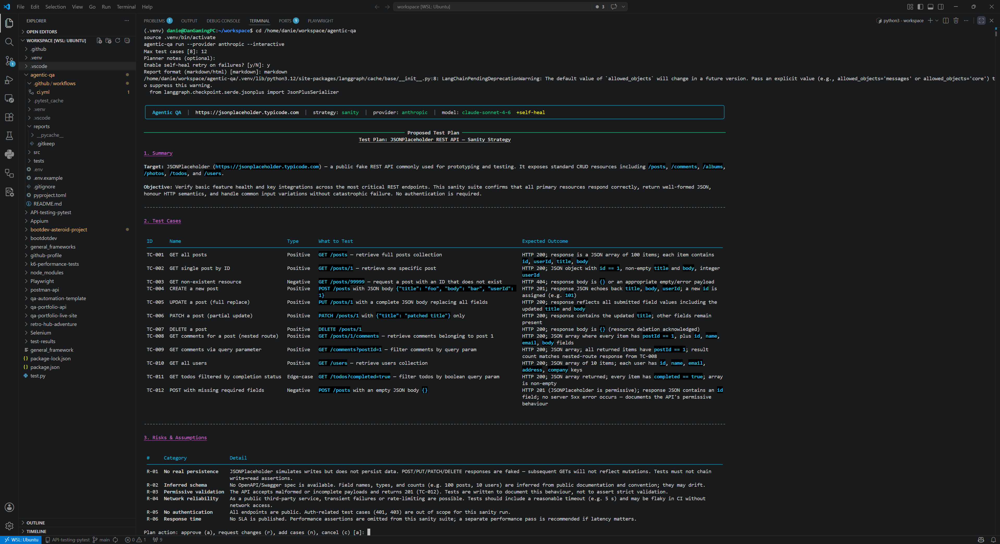

# Agentic QA

> **Multi-agent AI system that autonomously plans, writes, executes, and reports tests for REST APIs, web UIs, and Python codebases.**

[](https://www.python.org/)
[](https://github.com/langchain-ai/langgraph)
[](https://www.anthropic.com/)
[](https://pytest.org/)

---

## What It Does

Point Agentic QA at any target and it runs a full autonomous QA cycle:

```
You: agentic-qa run https://jsonplaceholder.typicode.com

Orchestrator  →  "This is a REST API"
Planner       →  Fetches endpoints, designs 10 test cases (positive + negative + edge)
Writer        →  Generates runnable pytest code using httpx
Executor      →  Runs pytest, captures output
Reporter      →  Produces a Markdown QA report with pass/fail analysis
```

All without you writing a single line of test code.

---

## Current Reliable Target Support

The following target types are currently reliable in this project:

| Application Type | Reliability | What it can currently do | Requirements |
|---|---|---|---|
| REST APIs (public or internal reachable over HTTP/HTTPS) | High | Generate and run `pytest` + `httpx` API checks (status, schema-shape, core assertions, edge/negative paths based on strategy) | 1) Reachable base URL or local OpenAPI/Swagger file (`.json/.yaml/.yml`) 2) Network access from runner 3) Any required auth details provided in target context/planning notes |
| Websites / Web Apps (browser-based UI) | Medium-High for stable UI flows | Generate and run Playwright-based UI tests (navigation, key interactions, smoke/sanity/regression coverage depending on strategy) | 1) Reachable URL 2) Chromium installed via `playwright install chromium` 3) Predictable/stable DOM for robust selectors 4) Test environment that permits browser automation |
| Local Python codebases/modules | Medium | Generate and run `pytest` unit-style tests for Python files/modules | 1) Local code path available to tool 2) Importable modules in active Python environment 3) Any package dependencies installed |

Not currently supported as a reliable first-class target:

- Windows desktop applications (WinAppDriver/UIA-based WinApps)
- Native macOS desktop apps
- Native mobile apps as a direct target in this tool's current flow

These may be added later, but the current stable implementation is focused on API, web, and Python code targets.

---

## Architecture

```
┌─────────────────────────────────────────────────────┐
│                  LangGraph Pipeline                  │
│                                                     │
│  [Orchestrator] → [Planner] → [Writer]             │
│                                    ↓                │
│                            [Executor]               │
│                                    ↓                │
│                            [Reporter]               │
└─────────────────────────────────────────────────────┘
```

| Agent | Responsibility |
|-------|----------------|
| **Orchestrator** | Classifies target as `api`, `web`, or `code` |
| **Planner** | Inspects target (fetches spec/page/source) and designs a test plan |
| **Writer** | Converts the plan to runnable `pytest` code (httpx / Playwright / unittest) |
| **Executor** | Runs the test file in a subprocess, captures stdout/stderr |
| **Reporter** | Analyses results and writes a Markdown QA report |

---

## Quickstart

### 1. Clone & install

```bash
git clone https://github.com/your-username/agentic-qa.git
cd agentic-qa
python -m venv .venv && source .venv/bin/activate
pip install -e ".[dev]"
playwright install chromium   # only needed for web targets
```

### 2. Configure

```bash
cp .env.example .env
# Edit .env and set LLM_PROVIDER + matching API key
```

### 3. Run

```bash
# Test a public REST API
agentic-qa run https://jsonplaceholder.typicode.com

# Interactive run setup + approval gate (recommended)
# Prompts for strategy (smoke/sanity/regression/custom), max tests,
# planning notes, and asks for plan approval before execution.
agentic-qa run https://jsonplaceholder.typicode.com --interactive

# Detailed mode is default: logs each stage and shows plan/code/execution output
agentic-qa run https://jsonplaceholder.typicode.com --provider anthropic --mode detailed

# Quiet mode: minimal output while running full process
agentic-qa run https://jsonplaceholder.typicode.com --provider anthropic --mode quiet

# Non-interactive run (CI-friendly)
agentic-qa run https://jsonplaceholder.typicode.com --no-interactive --strategy smoke

# Store generated tests under a project folder
agentic-qa run https://jsonplaceholder.typicode.com --project payments-api

# Generate tests with Gherkin-style Given/When/Then descriptions
agentic-qa run https://jsonplaceholder.typicode.com --description-style gherkin

# Run selected previous tests with the new generated tests
agentic-qa run https://jsonplaceholder.typicode.com \
	--project payments-api \
	--run-with-existing-tests \
	--existing-test ./reports/projects/payments-api/tests/generated_test_health_check_a1b2c3d4_01.py

# Test a website (UI / accessibility)
agentic-qa run https://example.com

# Test a local OpenAPI spec
agentic-qa run ./my-api/openapi.yaml

# Test a Python module
agentic-qa run ./src/mypackage/utils.py

# Show the test plan and generated tests too
agentic-qa run https://jsonplaceholder.typicode.com --show-plan --show-tests

# Auto-fix failing tests with the Healer agent
agentic-qa run https://jsonplaceholder.typicode.com --self-heal

# Get a self-contained HTML report instead of Markdown
agentic-qa run https://api.example.com --format html

# Use Claude
agentic-qa run https://api.example.com --provider anthropic --model claude-sonnet-4-6

# Use OpenAI
agentic-qa run https://api.example.com --provider openai --model gpt-4o

# Customise test count
agentic-qa run https://api.example.com --max-tests 15
```

### 4. Find your report

```
reports/
├── projects/
│   └── payments-api/
│       └── tests/
│           ├── generated_test_health_check_a1b2c3d4_01.py
│           └── generated_test_create_user_a1b2c3d4_02.py
└── report_jsonplaceholder_typicode_com_20260508_120000.md
```

### 5. Clean generated artifacts

```bash
# Preview what would be removed (older than 7 days)
agentic-qa clean

# Remove all generated tests/reports now
agentic-qa clean --all --apply
```

### 6. Launch the basic web UI (editable starter)

```bash
agentic-qa-ui
```

What the UI provides now:

- Form-based run setup (target, provider, strategy, max tests, notes)
- Staged approvals: plan case review first, then generated test file review, then execution
- Tabbed review UI for both test cases and generated test files, including Approve All actions
- Quiet Mode toggle with Detailed mode as default when Quiet Mode is off
- Quiet-only sub-toggles: `Show Approved Plan In Quiet Mode` and `Show Approved Tests In Quiet Mode`
- `Reset Current Workflow` button to clear in-progress approvals and restart cleanly
- Generated test and report preview after completion
- Lightweight context recall from previous UI runs (`reports/ui_run_history.jsonl`)
- Previous-test picker shows human-readable descriptions (not raw code snippets)
- Project-level run report table (date, description, success/failure, exit code, target, strategy)
- Duplicate-reuse notice when an existing test was reused instead of generating a duplicate
- Export buttons for project run reports (CSV and JSON)

Generated tests are now written as one test per file under each project folder, and each file includes a module description header for easier reuse and selection.
For split-file reliability, a project-level `conftest.py` is generated so shared fixtures (like `client`) are available to all files.

This is intentionally a simple base so you can customize it for application-specific workflows.

---

## Options

| Flag | Default | Description |
|------|---------|-------------|
| `--provider` / `-p` | `openai` | LLM provider: `openai` or `anthropic` |
| `--model` / `-m` | provider default | Model name for selected provider |
| `--max-tests` / `-n` | `10` | Target number of test cases |
| `--strategy` / `-s` | `smoke` | Test strategy: `smoke`, `sanity`, `regression`, `custom` |
| `--planning-notes` | empty | Extra planning instructions for required scenarios |
| `--project` | `default` | Project bucket where generated tests are stored |
| `--description-style` | `standard` | Test description style: `standard` or `gherkin` |
| `--run-with-existing-tests` | off | Run selected previous tests together with new generated tests |
| `--existing-test` | none | Existing test file path (repeat flag for multiple files) |
| `--deduplicate-tests` / `--no-deduplicate-tests` | `--deduplicate-tests` | Reuse existing duplicate tests in the project folder |
| `--interactive` / `--no-interactive` | `--interactive` | Enable setup prompts and plan approval before execution |
| `--mode` | `detailed` | Output mode: `detailed` (step logs + intermediate outputs) or `quiet` |
| `--reports-dir` / `-o` | `./reports` | Output directory |
| `--self-heal` | off | Rewrite and re-run failing tests via the Healer agent |
| `--format` / `-f` | `markdown` | Report format: `markdown` or `html` |
| `--show-plan` | off | Print the test plan to stdout |
| `--show-tests` | off | Print the generated test code to stdout |

`--show-plan` and `--show-tests` are primarily for quiet-mode visibility. In detailed mode (the default), plan and generated test output are already shown.

---

## Human-In-The-Loop Flow

When `--interactive` is enabled, Agentic QA now pauses after planning and lets you:

- Approve the proposed test cases before execution
- Request alterations to existing test cases
- Add additional test cases or coverage requests
- Cancel the run before any tests are generated or executed

---

## UI Extension Path (for app-specific customization)

If you want to adapt this for specific products/systems over time, start here:

- `src/agentic_qa/ui.py`
: Streamlit interface and run orchestration wrapper around CLI
- `src/agentic_qa/context_store.py`
: persisted run metadata + context recall helpers

Recommended future upgrades:

- Add per-application presets (required endpoints, auth templates, critical paths)
- Store richer context (known flaky cases, approved baselines, environment profiles)
- Add project-specific validators before execution
- Add run comparison views (latest vs previous baseline)

---

## Running the Unit Tests

```bash
pytest tests/ -v
```

---

## Tech Stack

- **[LangGraph](https://github.com/langchain-ai/langgraph)** — agent state graph and pipeline orchestration
- **[LangChain OpenAI](https://python.langchain.com/)** and **[LangChain Anthropic](https://python.langchain.com/)** — provider-selectable LLM integration
- **[httpx](https://www.python-httpx.org/)** — async-ready HTTP client for API target inspection and generated tests
- **[Playwright](https://playwright.dev/python/)** — browser automation for web targets
- **[pytest](https://pytest.org/)** — test runner for generated tests and self-tests
- **[Typer](https://typer.tiangolo.com/) + [Rich](https://rich.readthedocs.io/)** — CLI and terminal output

---

## Why This Is Interesting (for Recruiters)

- **Real agentic architecture** — not a single LLM call, but a coordinated multi-node graph with shared state
- **Generates runnable artefacts** — the output is actual `.py` test files you can inspect, version, and re-run
- **Target-agnostic** — one tool handles APIs, UIs, and source code
- **Observable** — every agent's reasoning is captured in the shared message history; the report explains failures

---

## Roadmap

- [ ] Parallel agent execution for large test suites
- [ ] GitHub Actions integration (run on PR open) ✅ done
- [ ] HTML report with embedded test code viewer ✅ done
- [ ] Self-healing: automatically retry failed tests with LLM-suggested fixes ✅ done
- [ ] Support for GraphQL and gRPC targets
- [ ] `--watch` mode: re-run on file change


